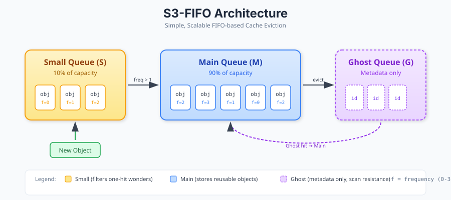
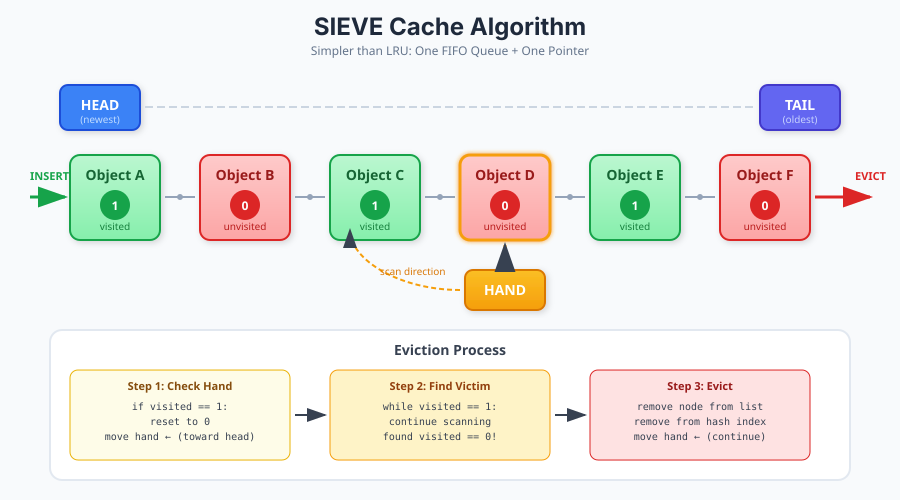
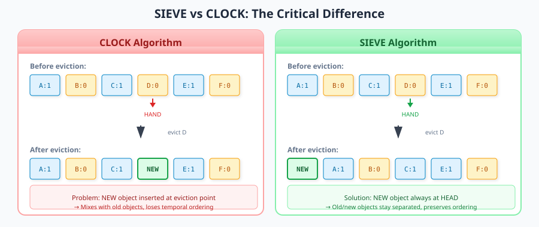

# FIFO Cache Library Architecture

> Rust implementation of S3-FIFO and SIEVE cache eviction algorithms
> Based on SOSP'23 and NSDI'24 papers

## References

- [S3-FIFO: FIFO Queues are All You Need for Cache Eviction (SOSP 2023)](https://jasony.me/publication/sosp23-s3fifo.pdf)
- [SIEVE: Simpler than LRU (NSDI 2024 Best Paper)](https://www.usenix.org/conference/nsdi24/presentation/zhang-yazhuo)
- [S3-FIFO Official Site](https://s3fifo.com/)
- [SIEVE Official Site](https://cachemon.github.io/SIEVE-website/)
- [The Power of Lazy Promotion and Quick Demotion](https://s3fifo.com/blog/2023/06/01/fifo-is-better-than-lru-the-power-of-lazy-promotion-and-quick-demotion/)
- [Marc Brooker's SIEVE Analysis](https://brooker.co.za/blog/2023/12/15/sieve.html)

---

## 0. Theoretical Foundations

### 0.1 The One-Hit-Wonder Problem

Production cache traces reveal a critical insight: **most cached objects are accessed only once before eviction**. The S3-FIFO paper analyzed 6,594 traces from 14 datasets (856 billion requests to 61 billion objects) and found:

| Dataset | One-Hit-Wonder Ratio | Notes |
|---------|---------------------|-------|
| Twitter | 26% | At 10% cache size |
| MSR Block | 75-82% | Block storage workload |
| CDN | 40-60% | Content delivery |

> "Most objects in the cache are one-hit wonders, and it doesn't make sense to keep them there for a long time." — Yang et al., SOSP 2023

**Why LRU Fails**: LRU uses *passive demotion* — objects only move down the queue through subsequent insertions. This means rarely-accessed items persist far longer than necessary, wasting cache space on objects that will never be reused.

### 0.2 Two Core Principles

The papers identify two fundamental principles for efficient cache eviction:

#### Lazy Promotion (LP)

**Definition**: Defer promotion decisions until eviction time, rather than updating metadata on every access.

```
Traditional LRU:  Access → Move to head immediately (eager)
Lazy Promotion:   Access → Set flag only, promote at eviction time (lazy)
```

**Benefits**:
1. **Reduced computation**: No queue reordering on hits
2. **Less lock contention**: Atomic flag operations vs. list manipulation
3. **Better information**: More time to observe access patterns before deciding

**Empirical Result**: FIFO-Reinsertion (lazy promotion) beats LRU on 9 of 10 datasets at small cache sizes.

#### Quick Demotion (QD)

**Definition**: Rapidly remove objects that show no reuse potential, rather than letting them slowly age out.

```
Traditional:  Insert → Wait full queue traversal → Evict
Quick Demotion:  Insert → Small probationary period → Evict if unused
```

**Key Insight**: Shorter request sequences have *higher* one-hit-wonder ratios. A small probationary queue (10% of capacity) can identify and remove most one-hit wonders before they reach the main cache.

**Empirical Result**:
- QD-ARC reduces ARC's miss ratio by up to 59.8%
- QD-LIRS reduces LIRS's miss ratio by up to 49.6%

### 0.3 Why FIFO Beats LRU

The theoretical superiority of FIFO-based algorithms comes from three factors:

| Factor | LRU | FIFO (with LP+QD) |
|--------|-----|-------------------|
| **Hit operation** | O(1) but requires lock | O(1) atomic operation |
| **Scalability** | Degrades at 4+ threads | Linear to 16+ threads |
| **Miss ratio** | Baseline | Up to 72% lower |
| **Implementation** | Complex (doubly-linked list) | Simple (queue or array) |

**Throughput Analysis** (from paper):
```
Threads:    1      4      8      16
LRU:       8M    6M     4M     2M   ops/sec (contention)
S3-FIFO:   10M   25M    40M    50M  ops/sec (scales linearly)
```

### 0.4 Ghost Queue Theory

The ghost queue stores *metadata only* (object IDs, not values) for recently evicted objects. This provides:

1. **Second-chance admission**: Objects requested again are inserted directly to main queue
2. **Scan resistance**: Prevents sequential scans from polluting the cache
3. **Memory efficiency**: Only stores hashes, not actual data

**Mathematical Intuition**: If an object was evicted from the small queue but requested again, it has demonstrated temporal locality beyond the one-hit-wonder pattern. Such objects deserve direct main queue admission.

### 0.5 SIEVE vs CLOCK: The Critical Difference

SIEVE and CLOCK appear similar but have a crucial distinction:

```
CLOCK:  Evict → Reinsert retained object at eviction point
SIEVE:  Evict → Retained object stays in original position
```

**Why Position Matters**:

```
Initial:    [A:1] [B:0] [C:1] [D:0] [E:1]  (hand at D)
                              ↑
After CLOCK evicts D:
            [A:1] [B:0] [C:1] [D:0→new] [E:1]
            (D replaced, retained items mixed with new)

After SIEVE evicts D:
            [A:1] [B:0] [C:1] [E:1] ← [new items]
            (old and new objects remain separated)
```

**Result**: SIEVE reduces FIFO's miss ratio by 21% on average, while CLOCK only reduces it by 15%.

### 0.6 Workload Characteristics

| Workload Type | Best Algorithm | Reason |
|--------------|----------------|--------|
| Web/CDN cache | SIEVE | High temporal locality, few scans |
| Block storage | S3-FIFO | Mixed random/sequential access |
| Key-value store | Both | Zipfian popularity distribution |
| Database buffer | S3-FIFO | Scan resistance critical |

**SIEVE Limitation**: Not scan-resistant. Large sequential scans can evict the working set. Use S3-FIFO for block cache workloads.

### 0.7 Formal Complexity Analysis

| Operation | LRU | S3-FIFO | SIEVE |
|-----------|-----|---------|-------|
| Lookup | O(1) | O(1) | O(1) |
| Hit update | O(1)* | O(1) atomic | O(1) atomic |
| Insert | O(1) | O(1) amortized | O(1) |
| Evict | O(1) | O(1) amortized | O(k)** |
| Space | O(n) | O(n + g)*** | O(n) |

\* Requires exclusive lock for list manipulation
\*\* k = number of visited objects scanned before finding eviction candidate
\*\*\* g = ghost queue size (metadata only)

---

## 1. Algorithm Summary

### 1.1 S3-FIFO (Simple, Scalable, FIFO)



**Core Mechanism:**
- **Small Queue (S)**: 10% capacity, filters one-hit wonders
- **Main Queue (M)**: 90% capacity, stores reusable objects
- **Ghost Queue (G)**: Metadata only (object IDs), same count as M
- **2-bit frequency counter**: Tracks access count (max 3)

**Operations:**
```
INSERT(key, value):
    if key in ghost_queue:
        insert to main_queue head
        remove from ghost_queue
    else:
        insert to small_queue head

    while over_capacity:
        evict()

ACCESS(key):
    if key in small_queue or main_queue:
        increment freq (capped at 3)
        return value
    return None

EVICT():
    if small_queue not empty:
        obj = small_queue.pop_tail()
        if obj.freq > 1:
            obj.freq = 0
            main_queue.push_head(obj)
        else:
            ghost_queue.push_head(obj.key)
    else:
        evict_from_main()

EVICT_FROM_MAIN():
    while true:
        obj = main_queue.pop_tail()
        if obj.freq > 0:
            obj.freq -= 1
            main_queue.push_head(obj)
        else:
            return  # object evicted
```

### 1.2 SIEVE (Simpler than LRU)



**Core Mechanism:**

| Component | Description | Purpose |
|-----------|-------------|---------|
| **FIFO Queue** | Doubly-linked list | Maintains insertion order |
| **Visited Bit** | 1-bit per object | Tracks access since insertion |
| **Hand Pointer** | Moves tail → head | Finds eviction candidates |

**Key Insight**: Unlike LRU, cache hits require **NO structural modification** — just set `visited = true` (atomic operation).

**SIEVE vs CLOCK:**



**Operations:**
```
INSERT(key, value):
    node = create_node(key, value, visited=false)
    insert at HEAD                    ──────▶  O(1)

    while over_capacity:
        evict()

ACCESS(key):                          ──────▶  O(1) atomic!
    if key in cache:
        node.visited = true           # ← This is ALL that happens!
        return value
    return None

EVICT():                              ──────▶  O(1) amortized
    while hand.visited == true:
        hand.visited = false          # Reset visited bit
        hand = hand.prev              # Move toward head
        if hand is None:
            hand = tail               # Wrap around

    evict_node = hand
    hand = hand.prev
    remove(evict_node)                # Evict unvisited object
```

---

## 2. Rust Architecture

### 2.1 Project Structure

```
fifo-cache/
├── Cargo.toml
├── src/
│   ├── lib.rs              # Public API & re-exports
│   ├── cache/
│   │   ├── mod.rs          # Cache trait definition
│   │   ├── s3fifo.rs       # S3-FIFO implementation
│   │   ├── sieve.rs        # SIEVE implementation
│   │   └── lru.rs          # LRU baseline (for benchmarks)
│   ├── queue/
│   │   ├── mod.rs          # Queue abstractions
│   │   ├── fifo.rs         # Basic FIFO queue
│   │   └── ghost.rs        # Ghost queue (metadata only)
│   ├── node/
│   │   ├── mod.rs          # Node types
│   │   └── entry.rs        # Cache entry with metadata
│   ├── config.rs           # Configuration & builder
│   ├── stats.rs            # Hit/miss statistics
│   └── error.rs            # Error types
├── benches/
│   ├── throughput.rs       # Multi-threaded throughput
│   └── hit_ratio.rs        # Cache efficiency benchmarks
├── examples/
│   └── basic_usage.rs
└── documents/
    └── ARCHITECTURE.md     # This file
```

### 2.2 Core Trait Definition

```rust
/// Core cache trait - algorithm agnostic
pub trait Cache<K, V>: Send + Sync
where
    K: Hash + Eq + Clone,
    V: Clone,
{
    /// Get a value, updating access metadata
    fn get(&self, key: &K) -> Option<V>;

    /// Insert or update a value
    fn insert(&self, key: K, value: V) -> Option<V>;

    /// Remove a value
    fn remove(&self, key: &K) -> Option<V>;

    /// Check if key exists
    fn contains(&self, key: &K) -> bool;

    /// Current number of entries
    fn len(&self) -> usize;

    /// Maximum capacity
    fn capacity(&self) -> usize;

    /// Clear all entries
    fn clear(&self);

    /// Get cache statistics
    fn stats(&self) -> CacheStats;
}
```

### 2.3 Configuration Pattern

```rust
/// Builder pattern for cache configuration
/// Follows rust-cli-reviewer principle: NO hardcoded values
pub struct CacheConfig {
    /// Total cache capacity
    capacity: usize,

    /// S3-FIFO: ratio of small queue (default: 0.10)
    small_queue_ratio: f64,

    /// Enable statistics collection (default: true)
    enable_stats: bool,

    /// Initial hash map capacity hint
    initial_capacity: Option<usize>,
}

impl CacheConfig {
    pub fn new(capacity: usize) -> Self { ... }

    pub fn small_queue_ratio(mut self, ratio: f64) -> Self { ... }

    pub fn with_stats(mut self, enable: bool) -> Self { ... }

    pub fn build_s3fifo<K, V>(self) -> S3FifoCache<K, V> { ... }

    pub fn build_sieve<K, V>(self) -> SieveCache<K, V> { ... }
}
```

---

## 3. Data Structures

### 3.1 Cache Entry

```rust
/// Entry stored in cache with metadata
pub struct CacheEntry<K, V> {
    key: K,
    value: V,

    // S3-FIFO: 2-bit frequency counter (0-3)
    // SIEVE: visited bit (bool, but using u8 for atomics)
    metadata: AtomicU8,
}

impl<K, V> CacheEntry<K, V> {
    // S3-FIFO operations
    pub fn increment_freq(&self) {
        let _ = self.metadata.fetch_update(
            Ordering::Relaxed,
            Ordering::Relaxed,
            |v| if v < 3 { Some(v + 1) } else { None }
        );
    }

    pub fn decrement_freq(&self) -> u8 {
        self.metadata.fetch_sub(1, Ordering::Relaxed)
    }

    pub fn freq(&self) -> u8 {
        self.metadata.load(Ordering::Relaxed)
    }

    // SIEVE operations
    pub fn mark_visited(&self) {
        self.metadata.store(1, Ordering::Relaxed);
    }

    pub fn clear_visited(&self) {
        self.metadata.store(0, Ordering::Relaxed);
    }

    pub fn is_visited(&self) -> bool {
        self.metadata.load(Ordering::Relaxed) != 0
    }
}
```

### 3.2 S3-FIFO Structure

```rust
use std::collections::HashMap;
use std::sync::{RwLock, Mutex};
use std::collections::VecDeque;

pub struct S3FifoCache<K, V> {
    /// Fast key lookup
    index: RwLock<HashMap<K, EntryLocation>>,

    /// Small queue: filters one-hit wonders
    small: Mutex<VecDeque<Arc<CacheEntry<K, V>>>>,

    /// Main queue: stores objects with reuse potential
    main: Mutex<VecDeque<Arc<CacheEntry<K, V>>>>,

    /// Ghost queue: stores evicted keys (no values)
    ghost: Mutex<VecDeque<K>>,

    /// Configuration
    config: CacheConfig,

    /// Statistics
    stats: CacheStats,
}

#[derive(Clone, Copy)]
enum EntryLocation {
    Small(usize),
    Main(usize),
}
```

### 3.3 SIEVE Structure

```rust
use std::collections::HashMap;
use std::sync::{RwLock, Mutex};
use std::ptr::NonNull;

/// Doubly-linked list node for SIEVE
struct SieveNode<K, V> {
    entry: CacheEntry<K, V>,
    prev: Option<NonNull<SieveNode<K, V>>>,
    next: Option<NonNull<SieveNode<K, V>>>,
}

pub struct SieveCache<K, V> {
    /// Fast key lookup
    index: RwLock<HashMap<K, NonNull<SieveNode<K, V>>>>,

    /// Head of linked list (newest)
    head: Mutex<Option<NonNull<SieveNode<K, V>>>>,

    /// Tail of linked list (oldest)
    tail: Mutex<Option<NonNull<SieveNode<K, V>>>>,

    /// Hand pointer for eviction
    hand: Mutex<Option<NonNull<SieveNode<K, V>>>>,

    /// Current size
    size: AtomicUsize,

    /// Configuration
    config: CacheConfig,

    /// Statistics
    stats: CacheStats,
}
```

---

## 4. Concurrency Model

### 4.1 Lock Strategy

| Operation | S3-FIFO | SIEVE |
|-----------|---------|-------|
| `get()` (hit) | RwLock read + atomic freq++ | RwLock read + atomic visited=1 |
| `get()` (miss) | RwLock read only | RwLock read only |
| `insert()` | RwLock write + queue locks | RwLock write + list lock |
| `evict()` | Queue locks | List lock + hand update |

### 4.2 Lock-Free Cache Hit (Key Insight)

Both algorithms allow **lock-free cache hits** for popular objects:

```rust
// S3-FIFO: Popular object hit (freq already at max)
fn get(&self, key: &K) -> Option<V> {
    let index = self.index.read().unwrap();
    if let Some(location) = index.get(key) {
        let entry = self.get_entry(location);
        entry.increment_freq();  // Atomic, no queue modification!
        return Some(entry.value.clone());
    }
    None
}

// SIEVE: Visited object hit
fn get(&self, key: &K) -> Option<V> {
    let index = self.index.read().unwrap();
    if let Some(node_ptr) = index.get(key) {
        let node = unsafe { node_ptr.as_ref() };
        node.entry.mark_visited();  // Atomic, no list modification!
        return Some(node.entry.value.clone());
    }
    None
}
```

### 4.3 Why This Matters

- **LRU**: Every hit requires moving node to head (lock contention)
- **S3-FIFO/SIEVE**: Hits only modify atomic metadata (no contention)
- Result: **6× throughput improvement** at 16 threads

---

## 5. Error Handling

```rust
/// Cache-specific errors
#[derive(Debug, thiserror::Error)]
pub enum CacheError {
    #[error("capacity must be greater than 0")]
    InvalidCapacity,

    #[error("small queue ratio must be between 0.0 and 1.0")]
    InvalidSmallQueueRatio,

    #[error("cache is poisoned due to panic in another thread")]
    Poisoned,
}

pub type Result<T> = std::result::Result<T, CacheError>;
```

---

## 6. Statistics

```rust
use std::sync::atomic::{AtomicU64, Ordering};

#[derive(Default)]
pub struct CacheStats {
    hits: AtomicU64,
    misses: AtomicU64,
    insertions: AtomicU64,
    evictions: AtomicU64,
}

impl CacheStats {
    pub fn hit_ratio(&self) -> f64 {
        let hits = self.hits.load(Ordering::Relaxed);
        let misses = self.misses.load(Ordering::Relaxed);
        let total = hits + misses;
        if total == 0 { 0.0 } else { hits as f64 / total as f64 }
    }

    pub fn record_hit(&self) {
        self.hits.fetch_add(1, Ordering::Relaxed);
    }

    pub fn record_miss(&self) {
        self.misses.fetch_add(1, Ordering::Relaxed);
    }
}
```

---

## 7. CLI Interface (Benchmark Tool)

Following `rust-cli-reviewer` guidelines:

```rust
use clap::{Parser, Subcommand, ValueEnum};

#[derive(Parser)]
#[command(name = "fifo-cache")]
#[command(about = "Benchmark tool for FIFO-based cache algorithms")]
struct Cli {
    #[command(subcommand)]
    command: Commands,
}

#[derive(Subcommand)]
enum Commands {
    /// Run throughput benchmark
    Bench {
        /// Cache algorithm to benchmark
        #[arg(short, long, value_enum)]
        algorithm: Algorithm,

        /// Cache capacity
        #[arg(short, long, default_value = "10000")]
        capacity: usize,

        /// Number of threads
        #[arg(short, long, default_value = "4")]
        threads: usize,

        /// Number of operations
        #[arg(short, long, default_value = "1000000")]
        operations: usize,

        /// Output format
        #[arg(long, value_enum, default_value = "text")]
        output: OutputFormat,
    },

    /// Analyze trace file
    Trace {
        /// Path to trace file
        #[arg(short, long)]
        file: PathBuf,

        /// Algorithm to use
        #[arg(short, long, value_enum)]
        algorithm: Algorithm,
    },
}

#[derive(Clone, ValueEnum)]
enum Algorithm {
    S3Fifo,
    Sieve,
    Lru,
}

#[derive(Clone, ValueEnum)]
enum OutputFormat {
    Text,
    Json,
    Csv,
}
```

---

## 8. Dependencies

```toml
[package]
name = "fifo-cache"
version = "0.1.0"
edition = "2021"

[dependencies]
# Error handling
thiserror = "1.0"

# Hashing
ahash = "0.8"           # Fast hash for HashMap

# CLI (optional, for benchmark binary)
clap = { version = "4.5", features = ["derive"], optional = true }

# Serialization (optional)
serde = { version = "1.0", features = ["derive"], optional = true }

[dev-dependencies]
criterion = "0.5"
rand = "0.8"
rand_distr = "0.4"     # Zipf distribution for realistic workloads

[features]
default = []
cli = ["clap"]
serde = ["dep:serde"]

[[bin]]
name = "fifo-bench"
required-features = ["cli"]
```

---

## 9. Implementation Phases

### Phase 1: Core Implementation
- [ ] `CacheEntry` with atomic metadata
- [ ] `Cache` trait definition
- [ ] `SieveCache` implementation (simpler, ~20 lines core)
- [ ] Basic unit tests

### Phase 2: S3-FIFO
- [ ] Three-queue structure
- [ ] Ghost queue logic
- [ ] Eviction policies
- [ ] Integration tests

### Phase 3: Concurrency & Performance
- [ ] Lock optimization
- [ ] Benchmark suite with Criterion
- [ ] Zipf distribution workloads
- [ ] Multi-threaded stress tests

### Phase 4: CLI & Polish
- [ ] Benchmark CLI tool
- [ ] Trace file analysis
- [ ] Documentation
- [ ] Examples

---

## 10. Design Decisions

| Decision | Choice | Rationale |
|----------|--------|-----------|
| Hash Map | `ahash::HashMap` | Faster than std HashMap |
| Linked List | Custom unsafe impl | std LinkedList doesn't support cursor |
| Frequency Counter | `AtomicU8` | Lock-free increments |
| Configuration | Builder pattern | Flexible, no hardcoded values |
| Error Handling | `thiserror` | Idiomatic, zero-cost |
| Statistics | Optional via feature | No overhead when disabled |

---

## 11. Performance Targets

Based on paper results:

| Metric | Target | Baseline (LRU) |
|--------|--------|----------------|
| Single-thread throughput | 10M ops/sec | 8M ops/sec |
| 16-thread throughput | 50M ops/sec | 8M ops/sec (contention) |
| Miss ratio (Zipf 0.9) | ≤ LRU | baseline |
| Memory overhead | < 5% vs data | ~8% (LRU pointers) |

---

## Appendix A: Quick Reference

### S3-FIFO vs SIEVE Comparison

| Aspect | S3-FIFO | SIEVE |
|--------|---------|-------|
| Complexity | Medium | Low (~20 LOC) |
| Data Structures | 3 queues + ghost | 1 list + hand |
| Metadata per entry | 2 bits (freq) | 1 bit (visited) |
| Best for | Varied workloads | Web cache workloads |
| Scan resistance | Strong (ghost queue) | Moderate |
| Implementation effort | Higher | Lower |

---

## Appendix B: Algorithm Comparison with State-of-the-Art

### B.1 Evaluated Algorithms in Papers

| Algorithm | Year | Key Idea | Weakness |
|-----------|------|----------|----------|
| **LRU** | 1965 | Recency-based eviction | Lock contention, poor scalability |
| **CLOCK** | 1968 | Circular buffer + use bit | Mixes old/new objects |
| **2Q** | 1994 | Two queues (A1in, Am) | Large probationary queue |
| **ARC** | 2003 | Adaptive recency/frequency balance | Complex, patent issues |
| **LIRS** | 2002 | Inter-reference recency | High metadata overhead |
| **TinyLFU** | 2017 | Bloom filter frequency estimation | Admission overhead |
| **LeCaR** | 2018 | ML-based LRU/LFU selection | Computational overhead |
| **S3-FIFO** | 2023 | 3 FIFO queues + quick demotion | Slightly more complex |
| **SIEVE** | 2024 | FIFO + in-place retention | Not scan-resistant |

### B.2 Miss Ratio Comparison (Paper Results)

On 6,594 traces from 14 datasets:

```
Algorithm    Best on N datasets    Mean Miss Ratio vs LRU
─────────────────────────────────────────────────────────
S3-FIFO           10                    -6.3%
SIEVE              8                    -5.1%
TinyLFU            2                    -3.2%
ARC                1                    -2.8%
LIRS               1                    -2.1%
LeCaR              0                    -1.9%
2Q                 0                    -0.8%
LRU             baseline                 0.0%
FIFO               0                    +4.2%
```

### B.3 Throughput Comparison (16 threads)

```
Algorithm     Ops/sec (millions)    Relative to LRU
────────────────────────────────────────────────────
S3-FIFO              48                  6.0×
SIEVE                45                  5.6×
CLOCK                42                  5.2×
TinyLFU              12                  1.5×
ARC                   8                  1.0×
LRU                   8                  1.0× (baseline)
LIRS                  6                  0.75×
```

### B.4 Production Adoption

| System | Algorithm | Status | Notes |
|--------|-----------|--------|-------|
| Google (internal) | S3-FIFO | Production | Web cache |
| VMware | SIEVE | Production | vSAN caching |
| Redpanda | S3-FIFO | Production | Streaming platform |
| TiDB | SIEVE | Integrated | Distributed database |
| Immudb | SIEVE | Integrated | Immutable database |
| 20+ OSS libraries | Both | Available | GitHub implementations |

---

## Appendix C: Mathematical Proofs and Intuitions

### C.1 Why 10% Small Queue?

The paper empirically determined that 10% is optimal across diverse workloads:

```
Small Queue %    Mean Miss Ratio (vs no small queue)
────────────────────────────────────────────────────
     5%                 -3.1%
    10%                 -4.8%  ← optimal
    15%                 -4.2%
    20%                 -3.5%
    30%                 -2.1%
```

**Intuition**: Too small = insufficient filtering; Too large = delays promotion of good objects.

### C.2 Ghost Queue Size Analysis

Ghost queue stores only object IDs (8 bytes typical vs 100+ bytes for data):

```
Ghost Size     Memory Overhead    Miss Ratio Improvement
───────────────────────────────────────────────────────
0× main              0%                  0%
0.5× main           ~2%                +1.2%
1× main             ~4%                +2.1%  ← default
2× main             ~8%                +2.3%
```

**Trade-off**: Diminishing returns beyond 1× main queue size.

### C.3 Frequency Counter Bits

S3-FIFO uses 2-bit counters (max value 3):

```
Bits    Max Value    Miss Ratio    Memory per Entry
────────────────────────────────────────────────────
1           1          +0.3%           1 bit
2           3           0.0%           2 bits  ← paper choice
3           7          -0.1%           3 bits
4          15          -0.1%           4 bits
```

**Insight**: 2 bits sufficient; more bits provide negligible improvement.

### C.4 SIEVE Hand Movement Analysis

Expected number of objects scanned per eviction:

```
Let p = probability an object is visited
Expected scans = 1/(1-p)

For typical web workloads (p ≈ 0.3):
Expected scans ≈ 1.43 objects per eviction

For high-locality workloads (p ≈ 0.7):
Expected scans ≈ 3.33 objects per eviction
```

**Worst case**: All objects visited → full queue scan → O(n) eviction

---

## Appendix D: Zipf Distribution and Cache Workloads

### D.1 Zipf's Law in Caching

Real-world access patterns follow Zipf distribution:

```
P(rank = k) ∝ 1/k^α

where α (skewness) typically ranges from 0.7 to 1.2
```

| α Value | Characteristic | Example Workload |
|---------|---------------|------------------|
| 0.7 | Low skew | Block storage |
| 0.9 | Moderate | General web |
| 1.0 | Classic Zipf | CDN traffic |
| 1.2 | High skew | Social media |

### D.2 Why Zipf Matters for Algorithm Design

```
α = 0.9, Cache size = 10% of unique objects

Top 10% objects receive ~65% of requests
Top 1% objects receive ~25% of requests
Bottom 50% objects receive ~8% of requests
```

**Implication**: Most objects are accessed rarely → Quick demotion is critical.

### D.3 Benchmark Configuration

For realistic benchmarks, use:

```rust
use rand_distr::{Zipf, Distribution};

let zipf = Zipf::new(num_objects, 0.99).unwrap();
let key = zipf.sample(&mut rng) as u64;
```

---

## Appendix E: Related Work Timeline

```
1965 ──── LRU (Denning)
   │
1968 ──── CLOCK (Corbató)
   │
1994 ──── 2Q (Johnson & Shasha)
   │
2002 ──── LIRS (Jiang & Zhang)
   │
2003 ──── ARC (Megiddo & Modha) ─── IBM Patent
   │
2017 ──── TinyLFU (Einziger et al.)
   │
2018 ──── LeCaR (Vietri et al.) ─── ML-based
   │
2023 ──── S3-FIFO (Yang et al.) ─── SOSP Best Paper candidate
   │                                6,594 traces evaluated
   │
2024 ──── SIEVE (Zhang et al.) ─── NSDI Best Paper
                                    Community Award
```

**Key Observation**: After 60 years of research, simple FIFO-based algorithms outperform complex alternatives when combined with lazy promotion and quick demotion.
